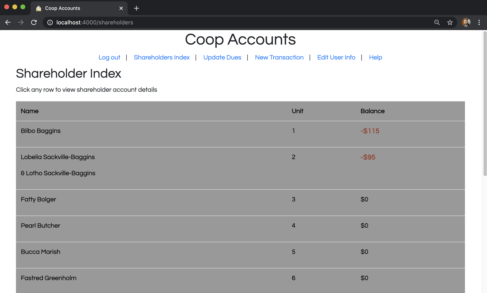
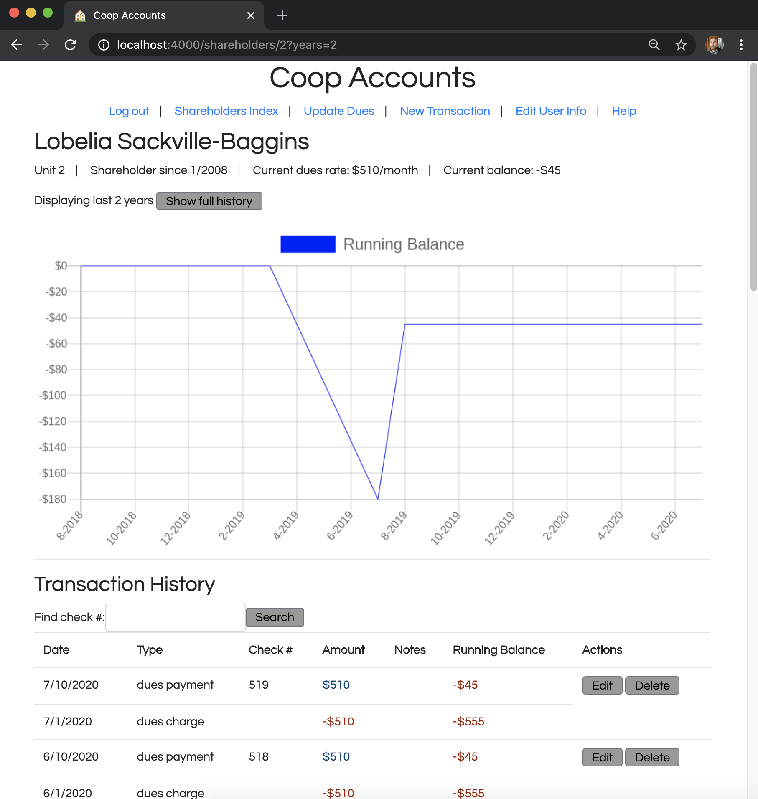
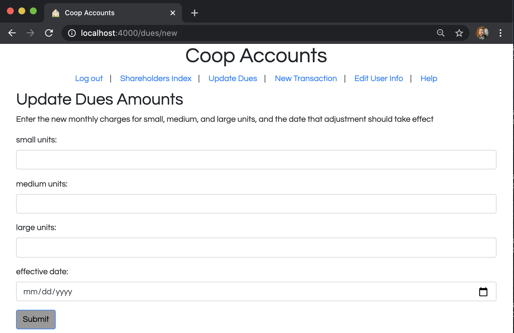

# Coop Accounts Documentation

## Inspiration

## User Stories

## Front End

The nav bar at the top of all pages contains links tailored to the user's login and administrator status.  All users are provided a link to these documents.  Logged-out users are given login and registration links.  Logged-in, non-administrator users are given links to log out, to update or delete their user account, and to their account homepage.  Logged-in, administrator users are given the same links as non-administrators (substituting the shareholder index for the single-account page), plus links to add new transactions & dues schemes.

The Shareholder Index page at /shareholders displays a list of all current shareholders, their unit number, and their current overall balance.  Since one of my user stories describes a user who wants to quickly see who is behind on their dues payments, negative balances are made to stand out by displaying them in red and using a slightly larger font.  Clicking on any shareholder's chart row links to their Show Shareholder page.  The clickability of the chart rows is made more intuitive by giving each row the same color-inversion mouseover effect shared by all buttons in the app, and also by on-screen instructions.

The Show Shareholder page at /shareholders/:id is the default landing page for logged-in, non-administrator shareholders, and also where administrators would go to examine individual accounts.  Since once of my user stories describes a shareholder who wants to quickly find out what they owe, their current monthly dues rate and current overall balance are listed at the top of the screen.

Below that is a graph showing the shareholder's balance history and a list of the most recent transactions on their account.  These are displayed to help individual shareholders understand how their current balance was arrived at, and also to allow them to verify that the coop's records for things like check numbers and payment amounts match the shareholder's own personal records.  By default, only the last 2 years' account history is displayed, but a button allows the viewer to toggle between the 2-year view and the shareholder's entire account history.  A search field allows the viewer to filter the transaction list by check number.  Administrators are additionally provided with buttons to edit or delete each listed payment.  Dues charges do not have those buttons, since dues are calculated automatically, and not even adminstrators should have the ability to modify them individually.

The running balance graph is generated by a query sent to the quickchart.io API.  To maximize readiblity, it charts only end-of-month balances.  Graphing daily balances would result in a mass of zig-zagging lines that is more difficult to interpret.

Most forms in the app are pretty straightforward, but the Update Dues form at /dues/new may be a bit more confusing for newcomers.  Despite the word 'update' in the header, the form's purpose is mainly to **create** dues database entries, and so is routed as a new/create route pair.
Dues adjustments happen to the entire building at once, so the form requires the user to enter new monthly dues charges for every class of unit, along with the date that change takes effect.

## Back End

### Database Models

This app makes use of five database models.  

The most connected one is the Shareholder model, which holds the shareholder's name (with room for a co-owner's name also) and the timespan of their tenancy.  

Shareholders may be associated with up to one User model.  The User model contains the necessary information for managing app authentication & authorization.  I've constructed it as a separate entity from the Shareholder model because while no shareholder is required to have any User attributes, if they have any, they must have them all.  A shareholder doesn't need to have a password, for instance, but if they do have one, they also need an email address.

Shareholders are associated with many transactions.  The Transaction model is used specifically for payments made by shareholders, not for charges levied against them.

Shareholders and Units are associated in a 1:1 relationship.  These two models could also potentially have been fused together, but I constructed them as separate entities to allow for future app expansion that would support units having multiple shareholders over time.  Also, on a conceptual level, Dues are determined by & charged to a Unit, and the Shareholder is responsible for paying those charges (via a Transaction) by virtue of the Shareholder's relationship to that Unit.  It seemed most natural for the database structure to reflect that.

The Dues model is probably the app's least intuitive model.  I constructed it with the intention of making the process of charging fees to shareholders as foolproof as possible - there is little worse than mistakenly charging a shareholder for an extra month because of a careless typo.  To minimize the risk of errors, the model's structure minimizes the number of separate dues database entries.  Each Dues entry consist simply of an amount, a unit size it applies to, a start date, and possibly an end date.  Even though dues are charged monthly, the app contains entries only for the date that the dollar amount of the monthly charge was last adjusted.  These entries are reconstructed into lists of monthly charges by the controller after retrieval from the database.  This allows for new charges to appear on the shareholder's account as time progresses without requiring any action from a human being.  This structure has the side benefit of minimizing database space usage - as it's currently seeded, the app contains nearly 3,000 Transaction entries, but only needs 27 Dues entries.

Dues conceptually have a many-to-many relationship with Units.  Because of the unique nature of that many-to-many relationship, though, Dues are not associated to any other model on a database level.  Units have many dues values over time as building maintenance expenses inevitably increase.  Dues charges are scaled according to unit size, so any given monthly Dues amount will be relevant to all units of a given size.  The two models are therefore associated (in the controller, not the database) via the 'size' (i.e. unit size) row in each model.  A given medium-size unit is related to all medium-size dues entries, and a given medium-size dues entry is related to all medium-size units.

